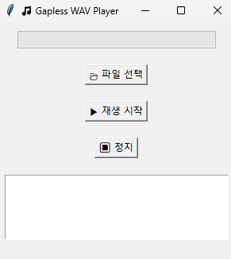

# GaplessGUIPlayer

**GaplessGUIPlayer**는 여러 개의 WAV 오디오 파일을 **끊김 없이(gapless)** 재생할 수 있는 Python 기반 GUI 플레이어입니다.  
`tkinter`를 사용하여 간단한 UI를 제공하며, `sounddevice` 라이브러리를 이용해 고품질의 실시간 오디오 스트리밍을 지원합니다.

---

## 주요 기능

- 여러 WAV 파일 선택 및 재생
- 끊김 없는(Gapless) 연속 재생
- 전체 재생 진행률 표시
- 가벼운 Python GUI (Tkinter 기반)

---

## 스크린샷



---

## 설치 및 실행

```bash
git clone https://github.com/2pterons/gapless-wav-player.git
cd gapless-wav-player
```

### 1. 필수 패키지 설치

```bash
pip install -r requirements.txt
```

### 2. 실행
```bash
python gapless_gui_player.py
```

### 사용방법
1. 파일 선택
2. 사용할 *.wav 파일 선택
3. 재생 시작
